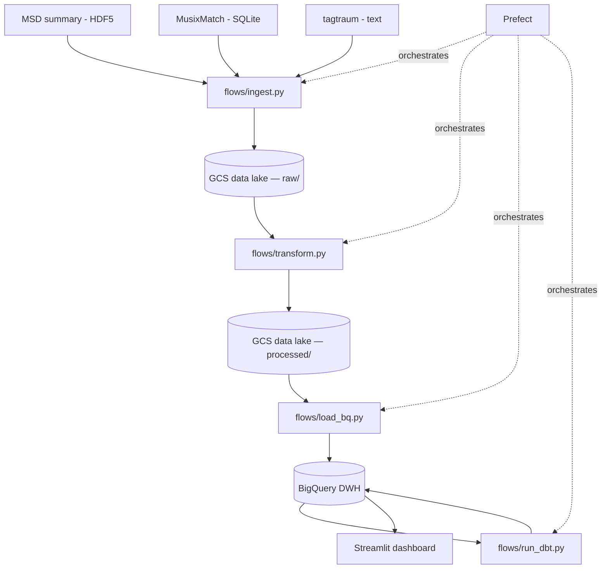
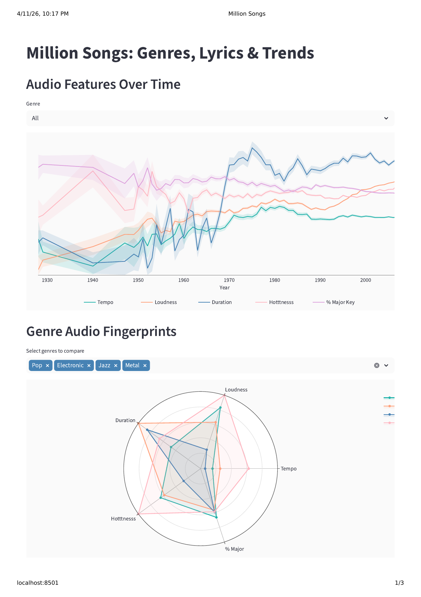
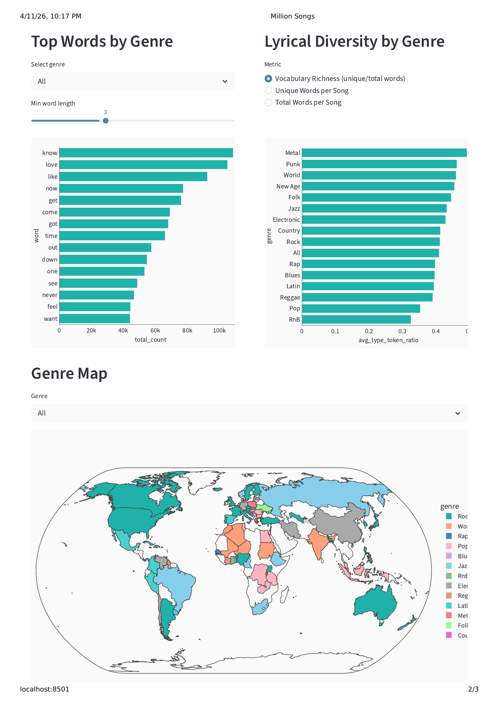

# Million Songs: Genres, Lyrics & Trends

## Problem Statement

**What defines a genre musically and lyrically, and how has popular music changed over time?**

Genres are often defined by cultural context, but do they have measurable audio and lyrical signatures? This project builds a batch data pipeline that joins three complementary datasets from the Million Song Dataset ecosystem into a unified analytical warehouse to explore:

- How audio characteristics of popular music have shifted over the decades
- Which audio features distinguish genres from each other
- What words are most characteristic of each genre
- Whether some genres are lyrically richer than others
- How genre prevalence varies geographically

## Datasets

- [Million Song Dataset](http://millionsongdataset.com/) (1M tracks) — audio features and metadata (tempo, loudness, key, year, etc.) via the MSD summary file (300 MB HDF5)
- [MusixMatch](http://millionsongdataset.com/musixmatch) — bag-of-words lyrics for 237k tracks (top 5000 stemmed words), SQLite
- [tagtraum genre annotations](http://www.tagtraum.com/msd_genre_datasets.html) (CD2C) — genre labels for 191k tracks across 15 genres, text

All datasets are joined on `track_id`.

## Architecture



## Technologies

- **Cloud**: Google Cloud Platform (GCS, BigQuery)
- **Infrastructure as Code**: Terraform
- **Workflow orchestration**: Prefect
- **Data warehouse**: BigQuery (tracks partitioned by year, tables clustered by genre/artist/word)
- **Batch processing**: Python (h5py + pyarrow for HDF5/SQLite → Parquet)
- **Transformations**: dbt
- **Dashboard**: Streamlit + Plotly

## Dashboard

<p float="left">
  
  
</p>

5 interactive panels:

1. **Audio features over time** — normalized tempo, loudness, duration, hotttnesss, % major key with 95% CI bands; filterable by genre
2. **Genre audio fingerprints** — radar chart comparing genres on normalized audio features
3. **Top words by genre** — most frequent words per genre (stop words filtered, adjustable word length)
4. **Lyrical diversity by genre** — vocabulary richness, unique words, total words per song
5. **Genre map** — choropleth: dominant genre per country or genre prevalence as % of artists

## How to Reproduce

### Prerequisites

- [gcloud CLI](https://cloud.google.com/sdk/docs/install) (authenticated with `gcloud auth login`)
- GCP project with billing enabled
- Docker Compose (or Podman with podman-compose)
- [Terraform](https://www.terraform.io/)

### Setup

```bash
git clone https://github.com/malbiruk/million-songs-pipeline.git
cd million-songs-pipeline
./setup.sh  # creates GCP service account, .env, and provisions infrastructure
```

### Run

```bash
docker compose up
```

- http://localhost:4200 — Prefect UI (monitor pipeline execution)
- http://localhost:8501 — Dashboard (available after pipeline completes)
