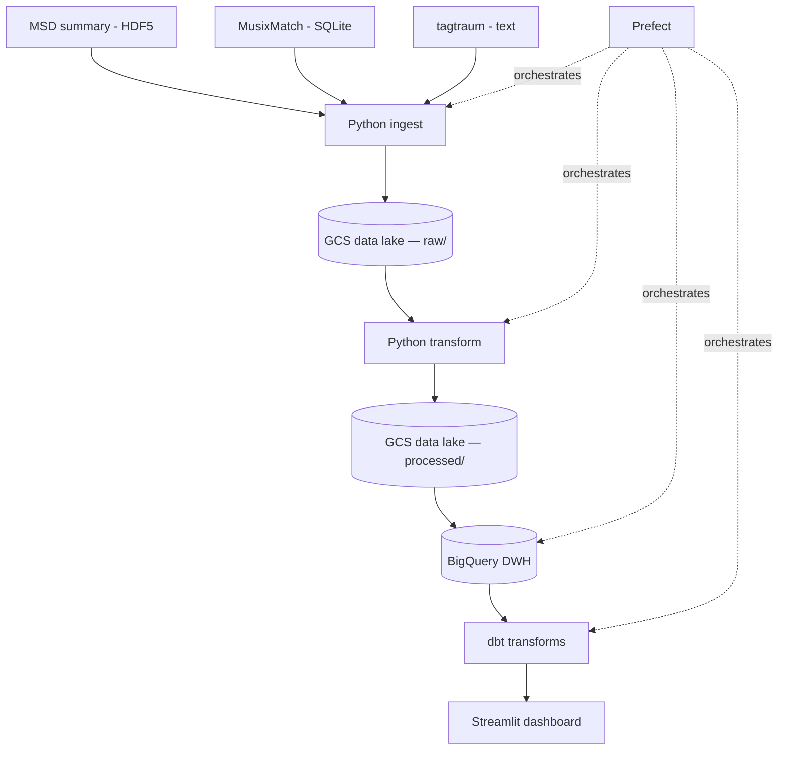

# Million Songs Pipeline

## Problem Statement

**What defines a genre musically and lyrically, and how has popular music changed over time?**

Genres are often defined by cultural context, but do they have measurable audio and lyrical signatures? This project builds a batch data pipeline that joins three complementary datasets from the Million Song Dataset ecosystem into a unified analytical warehouse to explore:

- Which audio features (tempo, loudness, energy) distinguish genres from each other
- What words are most characteristic of each genre
- How audio characteristics of popular music have shifted over the decades
- Whether some genres are lyrically richer than others

## Datasets

- [Million Song Dataset](http://millionsongdataset.com/) (1M tracks) — audio features and metadata (tempo, loudness, key, year, etc.) via the MSD summary file (300 MB HDF5)
- [MusixMatch](http://millionsongdataset.com/musixmatch) — bag-of-words lyrics for 237k tracks (top 5000 stemmed words), SQLite
- [tagtraum genre annotations](http://www.tagtraum.com/msd_genre_datasets.html) (CD2C) — genre labels for 191k tracks, text

All datasets are joined on `track_id`.

## Architecture

## Technologies

- **Cloud**: Google Cloud Platform (GCS, BigQuery, Cloud Run)
- **Infrastructure as Code**: Terraform
- **Workflow orchestration**: Prefect
- **Data warehouse**: BigQuery (partitioned by year, clustered by genre)
- **Batch processing**: Python + Cloud Run (h5py + pyarrow for HDF5/SQLite → Parquet)
- **Transformations**: dbt
- **Dashboard**: Streamlit

## Dashboard

4 panels:

1. **Top words by genre** — characteristic vocabulary per genre (categorical)
2. **Musical features over time** — avg tempo / loudness / energy by year (temporal)
3. **Genre audio fingerprints** — radar charts comparing genres on audio features (categorical)
4. **Lyrical diversity by genre** — vocabulary richness per genre (categorical)

## How to Reproduce

> TODO: instructions will be added as the pipeline is built
